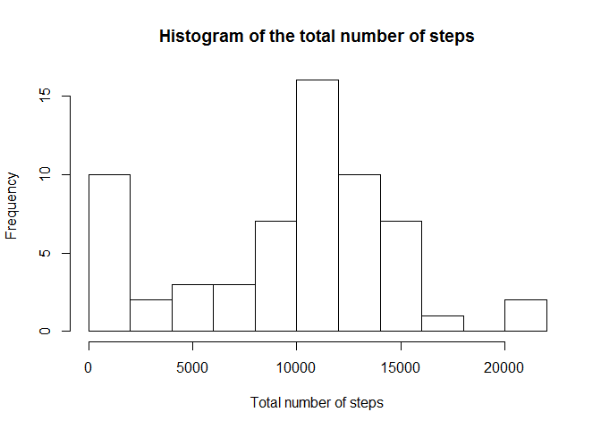
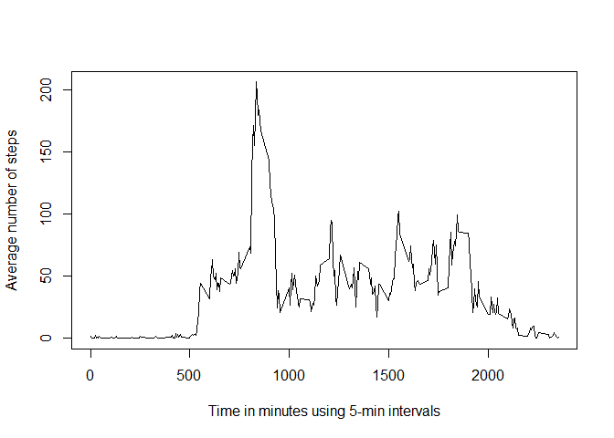
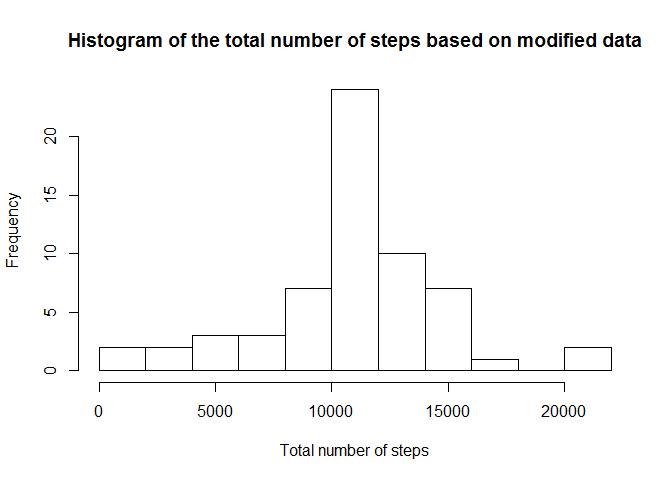

# Reproducible Research: Peer Assessment 1


## Loading and preprocessing the data
The data is first read.

```r
data<-read.csv("activity.csv")
```

## What is mean total number of steps taken per day?
The histogram is shown below after aggregating the data.

```r
totalSteps<-setNames(aggregate(data$steps, by=list(data$date), FUN=sum, na.rm=TRUE),c("Day","NumSteps"))
hist(totalSteps$NumSteps, breaks=10, xlab="Total number of steps", main="Histogram of the total number of steps")
```

 

The mean total number of steps taken each day is

```r
mean(totalSteps$NumSteps)
```

```
## [1] 9354
```

The median total number of steps taken per day is

```r
median(totalSteps$NumSteps)
```

```
## [1] 10395
```

## What is the average daily activity pattern?
The data is aggregated based on the time interval.

```r
averageSteps<-setNames(aggregate(data$steps, by=list(data$interval), FUN=mean, na.rm=TRUE),c("Time","NumSteps"))
plot(averageSteps$Time, averageSteps$NumSteps, type="l", xlab="Time in minutes using 5-min intervals", ylab="Average number of steps")
```

 

The maximum number of steps and the time interval in which it occurs is

```r
maxSteps<-max(averageSteps$NumSteps)
averageSteps[maxSteps==averageSteps$NumSteps,]
```

```
##     Time NumSteps
## 104  835    206.2
```
## Inputing missing values
The missing values are filled in using the mean for that 5-minute interval based on the average values obtained in the previous section.

```r
modifiedData<-data
for (i in 1:nrow(modifiedData)){
  if (is.na(modifiedData$steps[i]))
    modifiedData$steps[i]=averageSteps[which(modifiedData$interval[i]==averageSteps$Time),]$NumSteps
  
}
```

The histogram is shown below after aggregating the modified data.

```r
totalStepsModified<-setNames(aggregate(modifiedData$steps, by=list(modifiedData$date), FUN=sum, na.rm=TRUE),c("Day","NumSteps"))
hist(totalStepsModified$NumSteps, breaks=10, xlab="Total number of steps", main="Histogram of the total number of steps based on modified data")
```

 

The mean total number of steps taken each day based on the modified data is

```r
mean(totalStepsModified$NumSteps)
```

```
## [1] 10766
```

The median total number of steps taken per day based on the modified data is

```r
median(totalStepsModified$NumSteps)
```

```
## [1] 10766
```
Both the new mean and median from the modified data is higher after inputing missing data using the estimates of the total daily number of steps.

## Are there differences in activity patterns between weekdays and weekends?
A new column is created and a value is assigned based on whether the day is a weekday or weekend after which a panel plot is used to determine whether there is any difference in patterns between weekdays and weekends.

```r
modifiedData$dayType=weekdays(as.Date(modifiedData$date))
for (i in 1:nrow(modifiedData)){
  if (modifiedData$dayType[i]=="Monday")
    modifiedData$dayType[i]="weekday"
  if (modifiedData$dayType[i]=="Tuesday")
    modifiedData$dayType[i]="weekday"
  if (modifiedData$dayType[i]=="Wednesday")
    modifiedData$dayType[i]="weekday"
  if (modifiedData$dayType[i]=="Thursday")
    modifiedData$dayType[i]="weekday"
  if (modifiedData$dayType[i]=="Friday")
    modifiedData$dayType[i]="weekday"
  if (modifiedData$dayType[i]=="Saturday")
    modifiedData$dayType[i]="weekend"
  if (modifiedData$dayType[i]=="Sunday")
    modifiedData$dayType[i]="weekend"
}

averageStepsDayType<-setNames(aggregate(modifiedData$steps, by=list(modifiedData$interval,modifiedData$dayType), FUN=mean),c("Time","dayType","NumSteps"))
library(ggplot2)
qplot(data=averageStepsDayType, x=Time, y=NumSteps, facets=dayType~., xlim=c(0,2400), geom="line", xlab="Time in minutes using 5-min intervals", ylab="Average number of steps", main="Comparison between weekdays and weekends")
```

 
